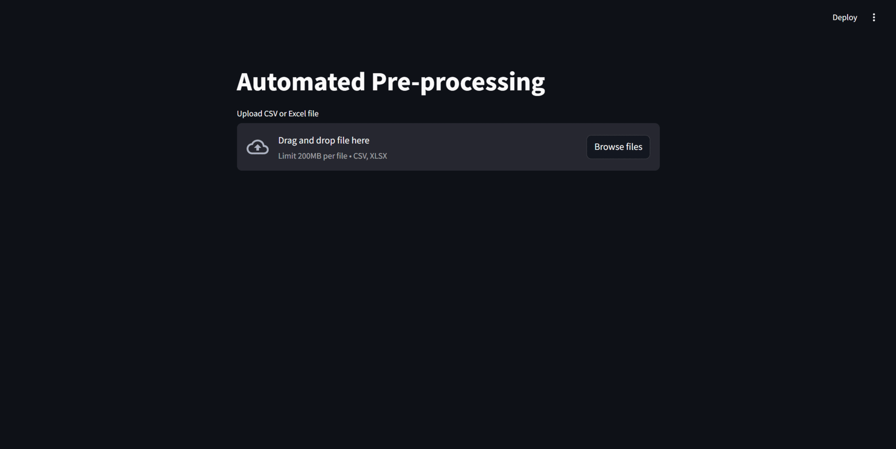

# Automated Data Pre-processing

Welcome to the Automated Data Pre-processing application! This Streamlit application allows you to upload a CSV or Excel file, clean and preprocess the data with various methods, and download the processed data.

## Features

- **Load Data**: Upload and preview your CSV or Excel files.
- **Remove Duplicates**: Identify and remove duplicate rows from your data.
- **Handle Missing Values**:
  - Fill missing numeric values with mean or median.
  - Fill missing categorical values with mode.
- **Remove Outliers**: Remove outliers using the Interquartile Range (IQR) method.
- **Apply All Functions Together**: Apply all the preprocessing steps in one go.
- **Download Processed Data**: Download the cleaned and processed data as a CSV file.

## Demo



## Installation

To run this application locally, follow these steps:

1. Clone the repository:
   ```bash
   git clone https://github.com/An1rud/Automated-Data-Pre-processing.git
   cd Automated-Data-Pre-processing
   ```

2. Install the required dependencies:
   ```bash
   pip install -r requirements.txt
   ```

3. Run the Streamlit application:
   ```bash
   streamlit run app.py
   ```

## Usage

1. **Upload a File**: Use the file uploader to upload your CSV or Excel file.
2. **Preview Data**: Preview the first few rows of your data, see data shape, description, and information.
3. **Remove Duplicates**: Remove duplicate rows from the data.
4. **Handle Missing Values**: Fill missing values with mean, median, or mode.
5. **Remove Outliers**: Remove outliers from numeric columns using the IQR method.
6. **Apply All Functions**: Apply all preprocessing steps together.
7. **Download Processed Data**: Download the processed data as a CSV file.

## Example

Here is a simple example of how to use the application:

1. Upload your data file.
2. Select the columns for filling missing values with mean, median, or mode.
3. Remove outliers from the numeric columns.
4. Download the cleaned data.

## Data

Any Excel or csv file can be used.
I have provided a [Sample Data](sampledata) which you can check out

## License

This project is licensed under the MIT License. See the [LICENSE](LICENSE) file for details.
